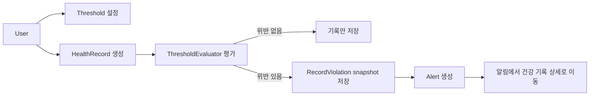

# Vitals Journal Server

사용자별 심박수와 혈압 기준을 설정하고, 건강 기록 생성 시점에 이상 징후를 평가해 앱 내 알림으로 연결하는 Spring Boot 백엔드 서버입니다.

---

## 1. 프로젝트 상태

| 항목 | 설명 |
| --- | --- |
| 백엔드 MVP | 회원가입, 로그인, 임계값 설정, 건강 기록 생성/조회, 위반 평가, 알림 조회/읽음 처리 |
| API 문서 | `docs/api/api-document.yaml`, Swagger UI |
| DB 마이그레이션 | Flyway 기반 schema 관리 |
| 테스트 | 단위 테스트(Domain, Service), MVC 테스트(Controller), DB 테스트(Repository) |
| CI/CD | GitHub Actions를 통한 자동화된 테스트 및 빌드 검증 |

```text
회원가입 -> 로그인 -> 임계값 설정 -> 건강 기록 입력 -> 임계값 평가 -> 알림 확인
```

---

## 2. 핵심 구현 흐름



### 구현 포인트

| 구현 포인트 | 설명 | 이유 |
| --- | --- | --- |
| 규칙 기반 건강 기록 평가 | HR, BP 기록 생성 시 현재 사용자 threshold를 조회해 위반 여부를 판단 | 단순 CRUD를 넘어 도메인 규칙이 있는 흐름을 구현 |
| Violation snapshot | threshold가 바뀌어도 과거 평가 결과가 변하지 않도록 `record_violation`에 평가 당시 기준 저장 | 데이터의 시간적 의미를 보존하는 설계 판단 |
| BP metric 분리 평가 | 하나의 BP 기록을 `BP_SYS`, `BP_DIA` 기준으로 나누어 평가 | 실제 도메인 특성에 맞게 모델을 단순화 |
| ProblemDetail 에러 응답 | validation, 인증 실패, 도메인 예외를 공통 형식으로 응답 | API 사용자가 실패 응답을 예측 가능하게 처리 |
| DB constraint와 index | unique index, check constraint, FK, 조회 index를 Flyway로 관리 | 애플리케이션 검증과 DB 무결성 방어선을 함께 둠 |
| 테스트와 CI | domain/service/controller/repository 계층 테스트와 GitHub Actions | 기능 변경 시 회귀를 확인할 수 있는 기반 |

---

## 3. 주요 기능

### 인증/사용자

- 회원가입
- 로그인
- JWT Access Token 발급
- 인증된 사용자 정보 조회
- 비밀번호 해싱
- 이메일/닉네임 중복 검증

### 임계값 Threshold

- 사용자별 threshold 목록 조회
- metric 단위 threshold 생성/수정
- 지원 metric
  - `HR`: 심박수
  - `BP_SYS`: 수축기 혈압
  - `BP_DIA`: 이완기 혈압
- `minValue`, `maxValue` 기반 range rule
- 사용자 1명당 metric 1개만 저장되도록 unique index 적용

### 건강 기록 Health Record

- 심박수 기록 생성
- 혈압 기록 생성
- 측정 시각 `measuredAt` 저장
- 건강 기록 목록 조회
- 건강 기록 상세 조회
- 상세 응답에서 위반 내역 함께 제공

### 위반 평가 Record Violation

- 건강 기록 생성 시 현재 threshold 기준으로 즉시 평가
- threshold가 없는 metric은 평가하지 않음
- 위반 발생 시 평가 당시의 threshold 기준을 snapshot으로 저장
- 하나의 BP 기록에서 수축기와 이완기 기준을 독립적으로 평가

### 알림 Alert

- 위반이 1개 이상 발생한 건강 기록에 대해 앱 내 알림 생성
- 알림 목록 조회
- 알림 읽음 처리
- 알림의 `healthRecordId`를 통해 건강 기록 상세 조회 가능

---

## 4. API Overview

| Method | Endpoint | 설명 | 인증 |
| --- | --- | --- | --- |
| `POST` | `/auth/register` | 회원가입 | X |
| `POST` | `/auth/login` | 로그인 및 Access Token 발급 | X |
| `GET` | `/user/me` | 내 정보 조회 | O |
| `GET` | `/thresholds` | 내 threshold 목록 조회 | O |
| `PUT` | `/thresholds/{metric}` | metric 단위 threshold 생성/수정 | O |
| `POST` | `/health-records` | 건강 기록 생성 및 즉시 평가 | O |
| `GET` | `/health-records` | 건강 기록 목록 조회 | O |
| `GET` | `/health-records/{healthRecordId}` | 건강 기록 상세 및 위반 내역 조회 | O |
| `GET` | `/alerts` | 알림 목록 조회 | O |
| `PATCH` | `/alerts/{alertId}/read` | 알림 읽음 처리 | O |

서버 실행 후 Swagger UI에서 API를 확인할 수 있습니다.

```text
http://localhost:8080/swagger-ui.html
```

---

## 5. 기술 스택

| 분류 | 기술 |
| --- | --- |
| Language | Java 17 |
| Framework | Spring Boot 3.5.x |
| Web | Spring MVC |
| Security | Spring Security, OAuth2 Resource Server, JWT |
| Persistence | Spring Data JPA |
| Database | PostgreSQL 18 |
| Migration | Flyway |
| API Docs | SpringDoc OpenAPI |
| Validation/Error | Jakarta Bean Validation, Spring `ProblemDetail` |
| Build | Gradle Kotlin DSL |
| Format | Spotless, Google Java Format |
| Container | Docker Compose |
| CI | GitHub Actions |

---

## 6. 설계 판단

### 6.1 Threshold 변경 이력 대신 Violation Snapshot 저장

threshold row를 직접 참조하면, 사용자가 나중에 기준을 바꿨을 때 과거 건강 기록의 평가 의미가 흔들릴 수 있습니다.

그래서 `record_violation`에는 평가 당시의 `minValue`, `maxValue`를 snapshot으로 저장했습니다. 현재 MVP의 range rule에서는 이 방식이 가장 단순하면서도 과거 판단 결과를 보존할 수 있습니다.

### 6.2 BP 기록과 BP metric의 분리

혈압 기록은 하나의 입력이지만, 수축기와 이완기는 서로 다른 기준으로 평가됩니다.

그래서 저장 타입은 `BP`로 유지하고, 평가 단계에서 `BP_SYS`, `BP_DIA` metric으로 분리했습니다. 이 방식은 API 입력을 단순하게 유지하면서도 평가 규칙은 독립적으로 다룰 수 있습니다.

### 6.3 ProblemDetail 기반 에러 응답

에러 응답은 별도 DTO를 만들기보다 Spring의 `ProblemDetail`을 기반으로 구성했습니다.

공통 필드인 `type`, `title`, `status`, `detail`, `instance`를 사용하고, 서비스 내부 오류 식별을 위해 `errorCode`를 확장 필드로 추가했습니다. 덕분에 validation error, 인증 실패, 도메인 예외가 API 전반에서 같은 형식으로 응답됩니다.

### 6.4 DB를 최종 무결성 방어선으로 사용

애플리케이션 레벨 검증만으로는 동시성이나 우회 저장 상황을 완전히 막기 어렵다는 문제가 있습니다.

그래서 Flyway migration에 다음 제약을 명시했습니다.

- 사용자 email, nickname unique index
- 사용자별 metric threshold unique index
- health record 타입별 필드 조합 check constraint
- 혈압 수축기/이완기 순서 check constraint
- alert와 health record의 사용자 일치 FK
- record violation metric 중복 방지 unique index

### 6.5 Threshold upsert 동시성 처리

사용자 1명이 같은 metric에 대해 threshold를 1개만 가져야 하므로, upsert 시 사용자 row에 pessimistic write lock을 사용하고 DB unique index를 함께 둡니다.

현재 MVP에서는 “중복 row가 생기지 않는 것”을 우선했고, 중복 생성 경쟁 상황에서 더 자연스러운 재시도 응답까지는 후속 개선 대상으로 남겼습니다.

---

## 7. 데이터베이스 구조

```text
users 1 --- N health_record
users 1 --- N threshold
users 1 --- N alert

health_record 1 --- N record_violation
health_record 1 --- 0..1 alert
```

주요 테이블은 다음과 같습니다.

| 테이블 | 역할 |
| --- | --- |
| `users` | 사용자 계정 정보 |
| `threshold` | 사용자별 건강 metric 기준 |
| `health_record` | 심박수/혈압 측정 기록 |
| `record_violation` | 건강 기록 생성 시점의 위반 평가 결과 |
| `alert` | 위반 기록에 대한 앱 내 알림 |

자세한 내용은 [docs/erd/ERD.md](docs/erd/ERD.md)

---

## 8. 프로젝트 구조

```text
src/main/java/io/github/jo0yo0n/vitalsjournal/
├── alert/           # 알림 도메인
├── auth/            # 회원가입, 로그인, JWT 발급
├── common/          # 공통 예외와 에러 응답
├── config/          # Security, JWT, JPA 설정
├── healthrecord/    # 건강 기록 생성, 조회, 평가 흐름
├── recordviolation/ # 평가 위반 내역
├── threshold/       # 사용자별 임계값
└── user/            # 사용자 조회
```

---

## 9. 로컬 실행

### 9.1 사전 준비

- Java 17
- Docker, Docker Compose

### 9.2 환경 변수 파일 생성

```bash
cp .env.example .env
```

### 9.3 JWT RSA key 생성

```bash
mkdir -p .local/keys
openssl genpkey -algorithm RSA -out .local/keys/local-private.key -pkeyopt rsa_keygen_bits:2048
openssl rsa -pubout -in .local/keys/local-private.key -out .local/keys/local-public.pub
```

`.env.example`의 기본 key 경로는 위 명령으로 생성되는 파일을 바라봅니다.

### 9.4 PostgreSQL 실행

```bash
docker compose up -d
```

### 9.5 애플리케이션 실행

```bash
./gradlew bootRun
```

---

## 10. 테스트와 검증

JPA 테스트는 실제 PostgreSQL 연결을 사용하므로, 테스트 전에 `docker compose up -d`로 DB를 실행해야 합니다.

```bash
./gradlew test
```

전체 검증은 다음 명령으로 실행합니다.

```bash
./gradlew check
```

`check`에는 테스트와 Spotless 포맷 검사가 포함됩니다. GitHub Actions에서도 PR 기준으로 같은 검증을 실행합니다.

### 테스트 구성

| 테스트 유형 | 검증 대상 |
| --- | --- |
| Domain test | 도메인 생성 규칙, 불변식, 잘못된 값 예외 |
| Service test | 비즈니스 흐름, threshold 평가, alert 생성, 예외 흐름 |
| Controller test | 요청 validation, 인증 principal 처리, status/body |
| Repository test | DB unique/check constraint, 정렬 조회, update query |
| Common error test | `ProblemDetail` 응답 형식, validation error mapping |

---

## 11. 관련 문서

| 문서 | 경로 |
| --- | --- |
| MVP 범위 | [docs/mvp/MVP.md](docs/mvp/MVP.md) |
| ERD | [docs/erd/ERD.md](docs/erd/ERD.md) |
| OpenAPI 문서 | [docs/api/api-document.yaml](docs/api/api-document.yaml) |
| Git 작업 규칙 | [docs/collaboration/GIT_WORKFLOW.md](docs/collaboration/GIT_WORKFLOW.md) |
